# 🧠 PsyLearn Profiler

> An **educational** psychology + machine-learning web app that turns a short study questionnaire into a learning-psychology profile with charts and personalized study recommendations.

**Authors:** Мартин Стаменов · Теодора Санева — project for *Psychology of Teaching and Learning (PNUV)*.

> 📘 **Full Macedonian documentation (Word) with screenshots of every page:** see [`DOCUMENTATION.docx`](DOCUMENTATION.docx).

PsyLearn Profiler is a student project built around psychology / PNUV course concepts —
**learning, motivation, memory techniques, personality and stress**. A user answers a
40-question survey (30 Likert items + 10 image-choice scenarios); a lightweight scikit-learn model converts the answers into
psychological sub-scores and predicts six educational profiles, which the frontend
displays with explanations, charts and study tips.

> ⚠️ **This is NOT a clinical tool.** It is an educational prototype based on course
> concepts, trained on **synthetic** data with transparent rule-based labels. It is not a
> psychological assessment, diagnosis, therapy tool or professional evaluation.

---

## 1. Project description

| Layer | Technology |
|-------|------------|
| Frontend | React 18 + Vite, React Router, **Recharts** |
| Backend | **FastAPI** (Python) |
| ML | **scikit-learn** `RandomForestClassifier` (one per target) |
| Persistence | **SQLite** (anonymous results only) |
| Model storage | **joblib** |
| Deploy | Render / Railway / Fly.io / any VPS · Docker & docker-compose included |

No GPU, no transformer models, no paid APIs — it is intentionally lightweight and
hosting-friendly.

The app has eight connected pages: **Home**, **Survey**, **Memory Trainer**,
**Learn** (knowledge base + technique library), **Results**, **Analytics
dashboard**, **Model insights** and **About / Disclaimer**.

It is more than a questionnaire — it includes:

- **HBSC data dashboard** — a `/hbsc` page visualizing REAL youth-wellbeing data
  from the WHO HBSC 2021/2022 study (~280,000 adolescents, 44 countries), with a
  girls-vs-boys gender-gap chart and each finding mapped to a platform feature.
  The whole app is positioned as a youth-wellbeing solution inspired by HBSC (the
  PNUV course assignment).
- **Wellness hub** — a daily **mood diary** (with a mood-over-time chart) and three
  rotating **daily wellness challenges**, building a wellness streak.
- **Flow** — a calm drawing canvas for de-stressing (named after the psychological
  "flow state"). Learning, training and wellness **streaks** show in the navbar.
- **Learn library** — plain-language explanations of all 18 concepts behind the
  app, plus a browsable library of 24 study & coping techniques, with a daily
  "concept of the day" and a learning streak.
- **Personalized techniques** — your results surface the techniques that fit your
  profile (e.g. calming methods if stress is high, group methods for extroverts).
- **Memory Trainer** — an interactive drill to *practice* the recommended memory
  techniques (study a word list, then recall it; best scores saved locally).
- **Personalized study plan** — a concrete, checkable weekly plan generated from
  the profile.
- **Model insights** — feature importances, confusion matrices and a sub-score
  correlation heatmap from the actual trained model.
- **Real-world benchmark** — your scores are compared against a REAL public-domain
  dataset (Open-Source Psychometrics Big Five, ~19,719 real respondents), not just
  synthetic data. Norms are computed by `build_world_norms.py`.
- **Report export** — download the result as a PDF (print), with a local history
  of previous attempts.
- **Resume** — the survey auto-saves progress and supports keyboard (1–5) entry.

---

## 2. Psychology course concepts used

The questionnaire and scoring are grounded in these topics:

- **Learning & motivation** — why we study and what drives effort
- **Intrinsic vs. extrinsic motivation** (and pressure / controlled motivation)
- **Learning goals vs. performance goals** (mastery vs. comparison; avoidance)
- **Memory and forgetting**
- **Memory techniques** — method of loci, association, story method, first-letter
  method, repetition, and teaching others
- **Emotions, frustration and stress** and their effect on concentration
- **Personality** — introversion / ambiversion / extraversion and Big-Five-style traits
- **Perception of self and behavior during learning**

The 40 questions are grouped into 6 sections (A Motivation, B Learning goals,
C Study style, D Memory, E Personality & emotions, F Real-life image-choice
scenarios). All 40 answers feed the same 16 sub-scores.

### The 16 psychological sub-scores

The answers are converted into 16 sub-scores (each on the 1–5 scale), e.g.
`intrinsic_motivation_score`, `extrinsic_motivation_score`, `learning_goal_score`,
`performance_goal_score`, `deep_learning_score`, `surface_learning_score`,
`memory_visual_score`, `stress_score`, `introversion_score`, … (full list in
[`backend/app/scoring.py`](backend/app/scoring.py)).

### The 6 predicted profiles

| Target | Classes |
|--------|---------|
| `motivation_type` | intrinsic · extrinsic · mixed · pressure_based |
| `learning_orientation` | learning_goal_oriented · performance_goal_oriented · avoidance_oriented · mixed_orientation |
| `study_style` | deep_learner · surface_learner · last_minute_learner · mixed_learner |
| `recommended_memory_method` | method_of_loci · association_method · story_method · first_letter_method · repetition · teach_someone_else |
| `personality_profile` | introvert · ambivert · extrovert |
| `stress_risk` | low · moderate · high |

---

## 3. ML model explanation

- **One `RandomForestClassifier` per target** (6 models), bundled together in a single
  `model.joblib`. Random forests are fast, need no GPU, handle the small tabular feature
  set well, and are easy to retrain.
- **Features**: the 16 sub-scores, in a fixed order saved to `features.json`. The API and
  the trainer import the *same* `compute_scores()` function, so the features used at
  prediction time are guaranteed identical to those used in training.
- **Labels**: generated by transparent, human-readable rules in
  [`backend/app/labeling.py`](backend/app/labeling.py) (e.g. *"if intrinsic exceeds
  extrinsic by ≥ 0.5 → intrinsic"*). The model learns to reproduce these rules, so its
  behaviour is auditable.
- **Metrics**: `train_model.py` prints accuracy, macro precision / recall / F1 and a
  confusion matrix per target, and saves them to `model_metadata.json`.

Because the data is synthetic and the labels are rule-based, accuracy is high by design
(~0.93–1.00 per target). **This demonstrates the ML pipeline; it is not evidence of
real-world psychological validity.**

---

## 4. How synthetic data is generated

`train_model.py` creates **3,000** synthetic respondents (well above the 2,000 minimum):

1. For each respondent it samples a latent trait per psychological construct (uniformly
   across the 1–5 range) so the full variety of profiles is represented.
2. Each question's answer = `clip(round(latent + gaussian_noise), 1, 5)` — realistic,
   internally-consistent Likert responses.
3. The 16 sub-scores are computed with the production `compute_scores()`.
4. The 6 labels are assigned with the rule-based logic in `labeling.py`.

`seed_data.py` reuses the same generator to insert ~180 anonymous results into SQLite so
the **Analytics dashboard is populated on first run**.

---

## 5. How to train the model

```bash
cd backend
python -m venv venv
# Windows:  venv\Scripts\activate
# macOS/Linux:
source venv/bin/activate
pip install -r requirements.txt

python train_model.py     # creates artifacts/model.joblib, model_metadata.json, features.json
python seed_data.py       # (optional) seed demo analytics into psylearn.db
```

Artifacts are written to `backend/artifacts/`.

---

## 6. How to run the backend

```bash
cd backend
source venv/bin/activate            # if not already active
uvicorn app.main:app --reload
```

- API root: <http://localhost:8000>
- Interactive docs (Swagger): <http://localhost:8000/docs>

### Endpoints

| Method | Path | Purpose |
|--------|------|---------|
| GET | `/health` | service + model status |
| GET | `/questions` | the 40 questions grouped by section (Likert + scenarios) |
| POST | `/predict` | score answers and predict the profile |
| GET | `/analytics/summary` | headline aggregate analytics |
| GET | `/analytics/distributions` | full label distributions + average scores |
| GET | `/analytics/correlations` | Pearson correlation matrix of the 16 sub-scores |
| GET | `/model/insights` | model metrics, feature importances, confusion matrices |
| GET | `/benchmark/world` | real-world Big Five norms + sub-score mapping (real data) |
| POST | `/feedback` | store anonymous feedback |

`POST /predict` request body:

```json
{ "answers": { "q1": 4, "q2": 2, "…": 3, "q40": 5 } }
```

CORS is configured via the `ALLOWED_ORIGINS` environment variable (comma-separated list,
or `*` for development). See `backend/.env.example`.

---

## 7. How to run the frontend

```bash
cd frontend
npm install
npm run dev
```

- App: <http://localhost:5173>

Set the API URL with `VITE_API_URL` (see `frontend/.env.example`); it defaults to
`http://localhost:8000`.

---

## 8. How to deploy

### Option A — Docker (any VPS / local)

```bash
docker compose up --build
# frontend -> http://localhost:5173   backend -> http://localhost:8000
```

### Option B — Render (blueprint included)

The repo ships a `render.yaml`:
- **Backend**: Docker web service from `backend/Dockerfile` (`/health` health check).
  After the first deploy, set `ALLOWED_ORIGINS` to your frontend URL.
- **Frontend**: static site (`npm run build` → `frontend/dist`) with an SPA rewrite.
  Set `VITE_API_URL` to your backend URL.

### Option C — Railway / Fly.io

Point the platform at the repository root `Dockerfile` (builds the backend and trains the
model during the image build; `$PORT` is honoured automatically). Deploy the frontend as a
static site, or with `frontend/Dockerfile` (nginx).

### Option D — Vercel / Netlify (frontend only)

Build command `npm run build`, output directory `dist`, project root `frontend/`, and set
the `VITE_API_URL` environment variable.

> SQLite is fine for this demo. On platforms with ephemeral disks the analytics DB resets
> on redeploy; the image re-seeds itself so the dashboard is never empty.

---

## 9. Disclaimer

> This application is an educational prototype for a psychology/machine learning student
> project. It is not a clinical psychological assessment, diagnosis, therapy tool or
> professional evaluation. Results are approximate and based on a lightweight ML model
> trained on synthetic educational data.

**Privacy:** only anonymous survey results (the 16 sub-scores and the 6 predicted labels)
are stored. No names, emails, or personal identifiers are collected.

---

## 10. Screenshots

Real screenshots of every page live in [`docs/screenshots/`](docs/screenshots) and are
embedded with descriptions in the Word documentation [`DOCUMENTATION.docx`](DOCUMENTATION.docx).

| Home | HBSC data | Survey |
|------|-----------|--------|
| 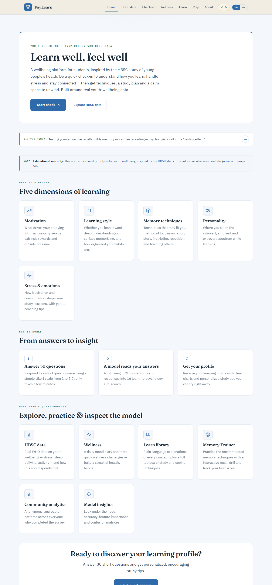 | 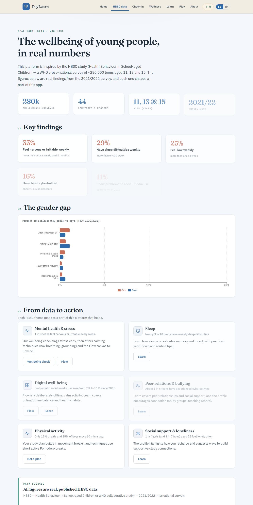 | 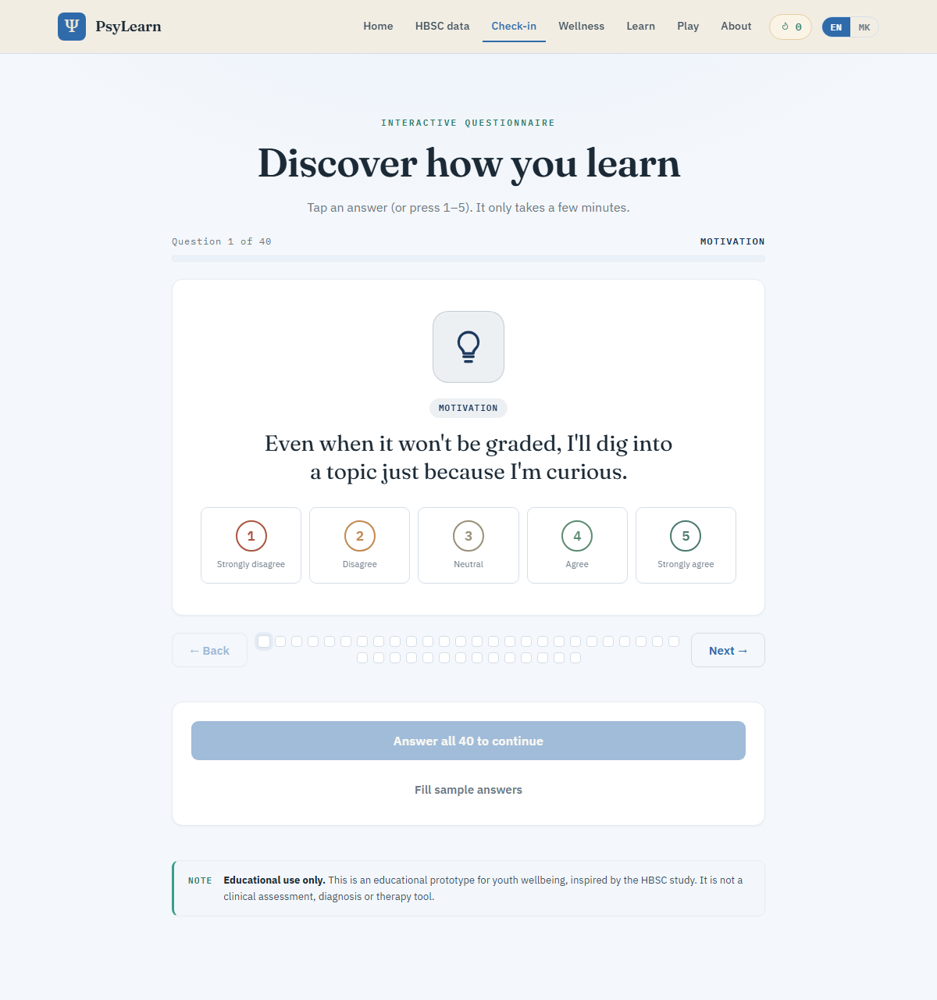 |

| Results | Wellness | Learn |
|---------|----------|-------|
| 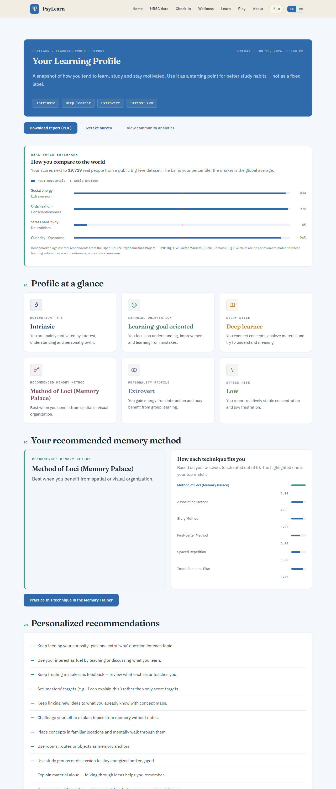 | 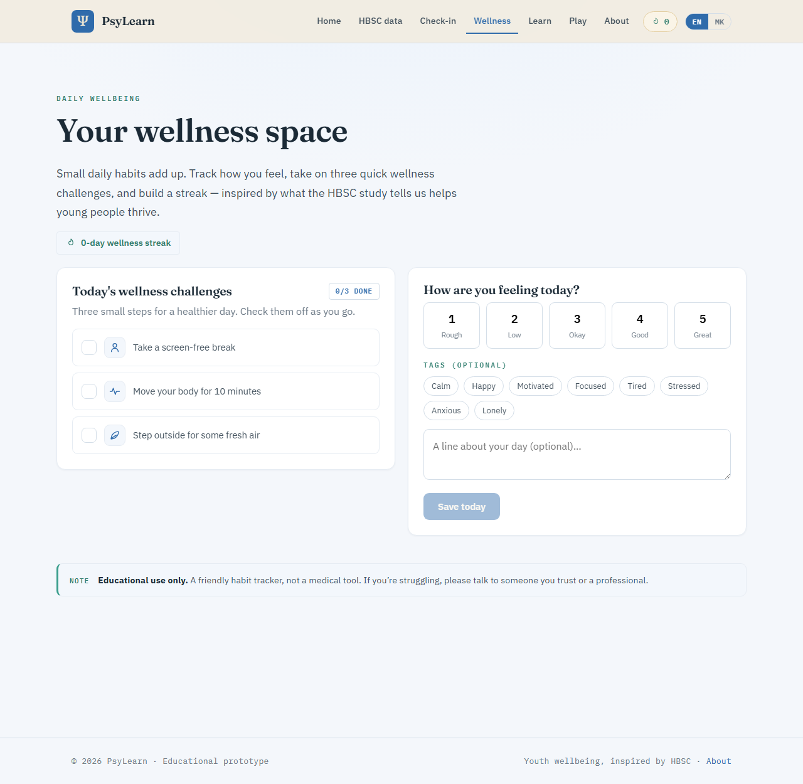 | 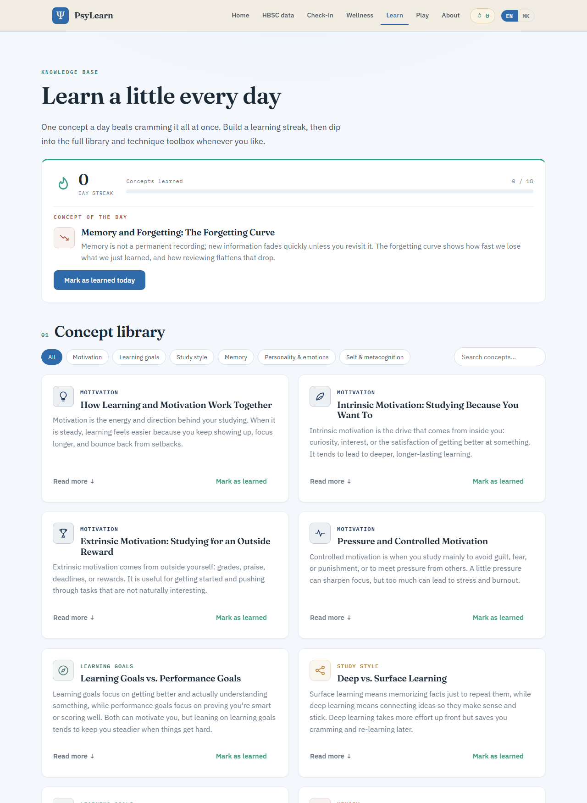 |

| Play hub | Perception | Analytics |
|----------|------------|-----------|
| 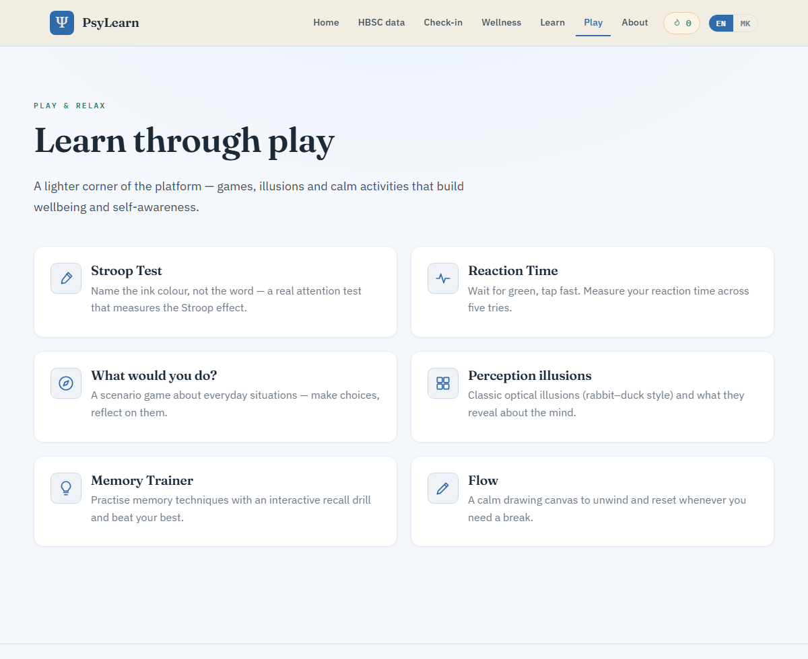 | 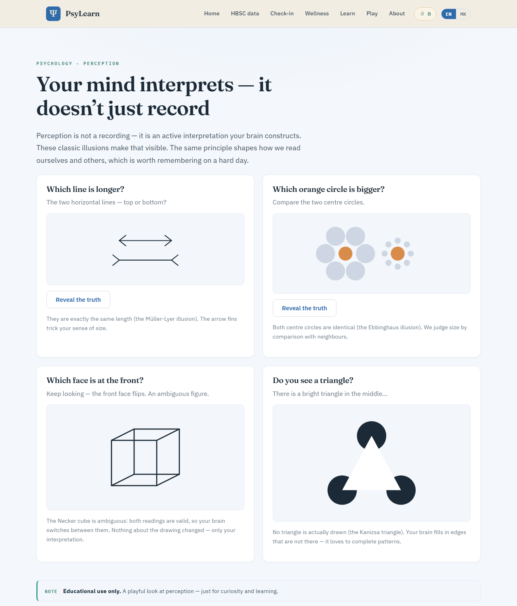 | 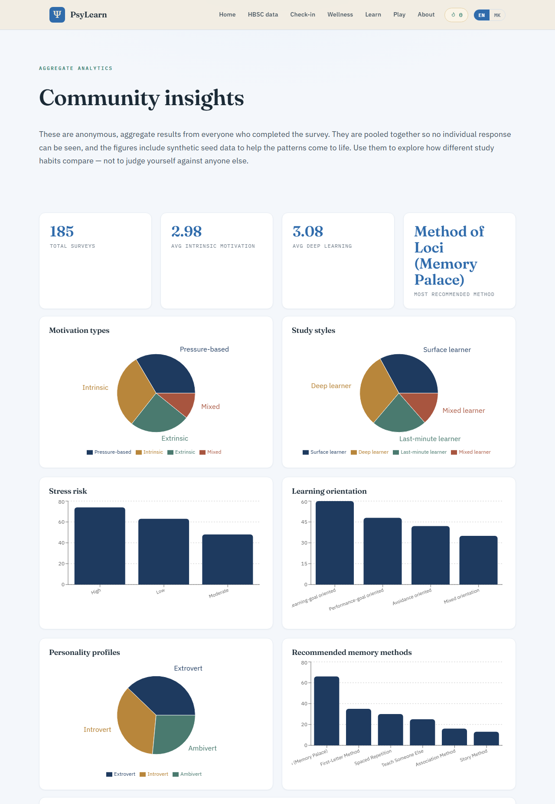 |

| Model insights | Trainer | Macedonian (МК) |
|----------------|---------|-----------------|
| 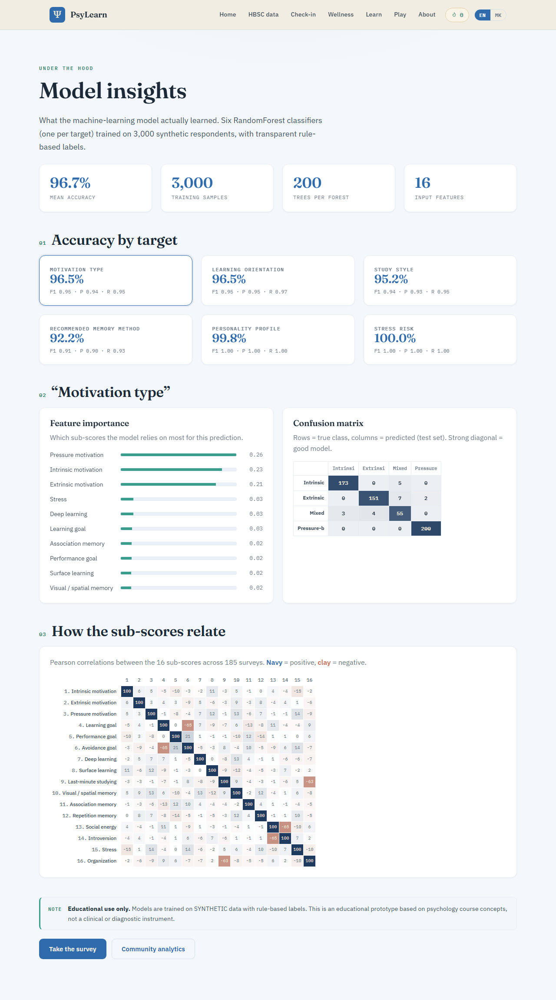 | 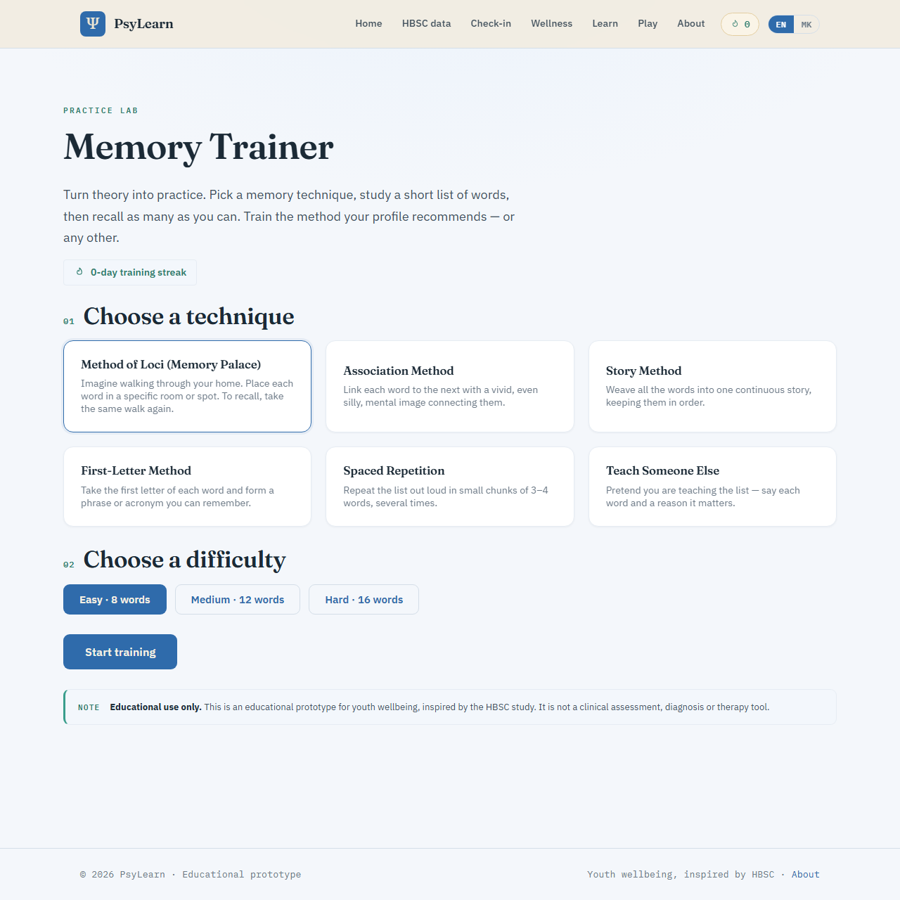 | 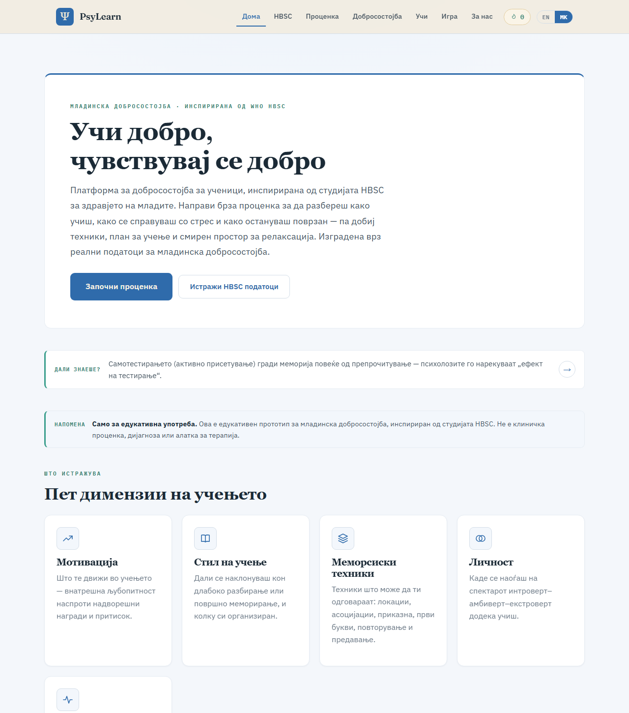 |

Additional shots: `stroop.png`, `reaction.png`, `game.png`, `flow.png`, `about.png`,
`survey-mk.png`.

---

## Project structure

```
psylearn-profiler/
├─ backend/
│  ├─ app/
│  │  ├─ main.py            # FastAPI endpoints
│  │  ├─ schemas.py         # Pydantic models
│  │  ├─ scoring.py         # questions + sub-score computation (source of truth)
│  │  ├─ labeling.py        # transparent rule-based labels
│  │  ├─ explanations.py    # label -> human-readable text
│  │  ├─ recommendations.py # personalized study tips
│  │  ├─ database.py        # SQLite (anonymous results)
│  │  └─ model_service.py   # loads model.joblib, runs predictions
│  ├─ artifacts/            # model.joblib, model_metadata.json, features.json
│  ├─ train_model.py        # synthetic data + training + evaluation
│  ├─ seed_data.py          # seed analytics so the dashboard isn't empty
│  └─ requirements.txt
├─ frontend/
│  └─ src/
│     ├─ pages/             # Home, Survey, Results, Analytics, About
│     ├─ components/        # QuestionCard, LikertScale, ProgressBar, ResultCard, …
│     ├─ charts/            # Recharts components
│     ├─ api/               # API client
│     └─ styles/            # global design system
├─ Dockerfile              # root: backend deploy target
├─ docker-compose.yml
├─ render.yaml
└─ README.md
```

Built as a student educational project. Be kind, stay curious, and remember it's just a
learning tool. 🎓
